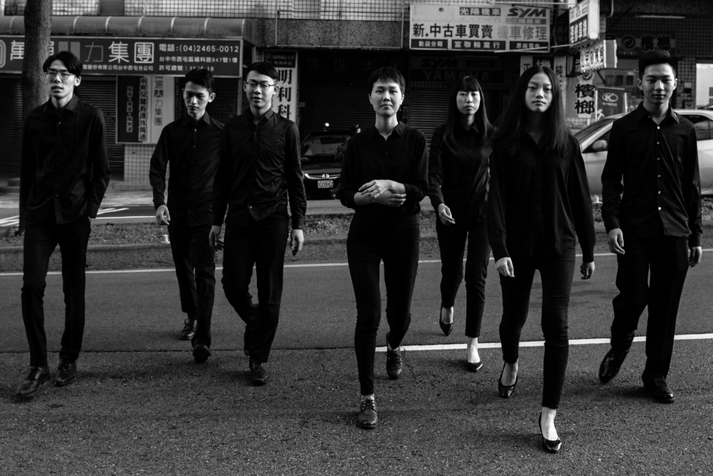

「Holiday」樂團之所以名為假期，是來自於團員們唯一能相聚的珍貴時刻。平日團員們因分隔南北，僅能在課後之餘的週末假期相聚練琴。

團員林紘妙、賴玠嘉、吳博申、翁子茵、孟奕明、陸美心、蔡長廷，不僅是自幼便一同習琴的夥伴，更是米可吉他趙柏群老師最珍視的名下高徒，每一位都經過10年以上的職業級訓練。

表演風格揉合了渡假氣息濃厚的Chill Pop，以及古典吉他的細膩魅力，成立僅兩年，已獲得2018年台灣吉他大賽重奏組冠軍、2018年亞洲國際吉他交響樂大賽重奏組冠軍。