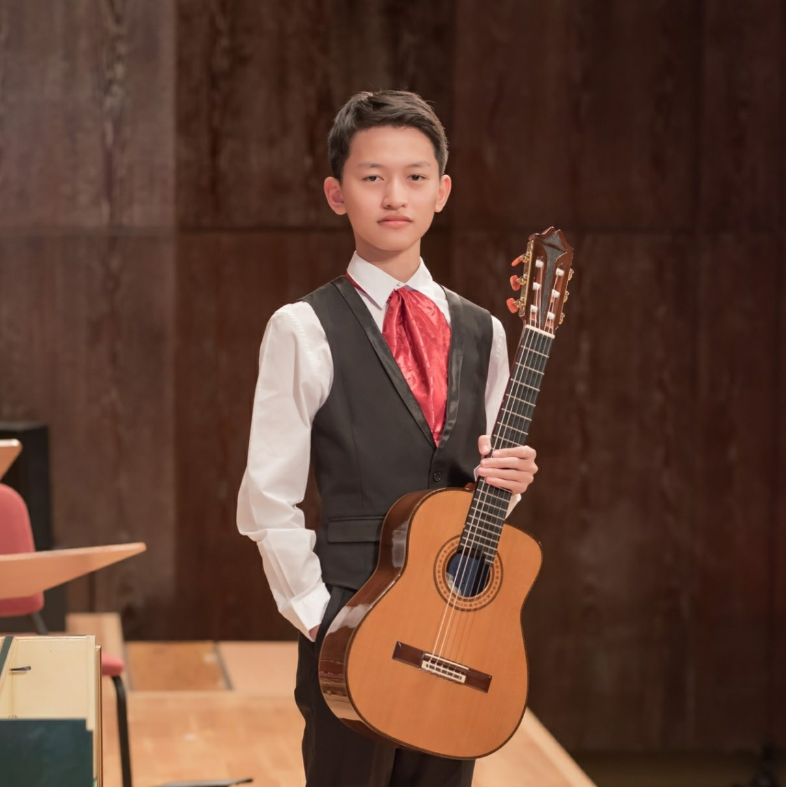
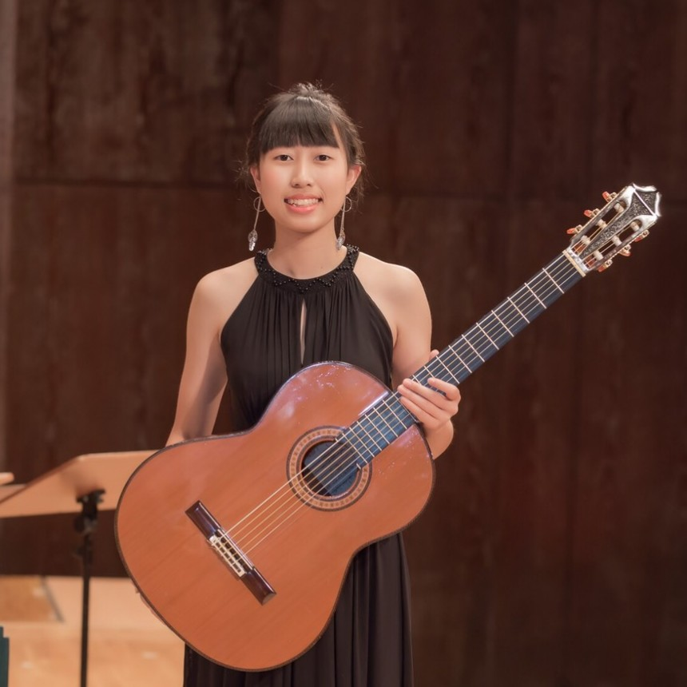
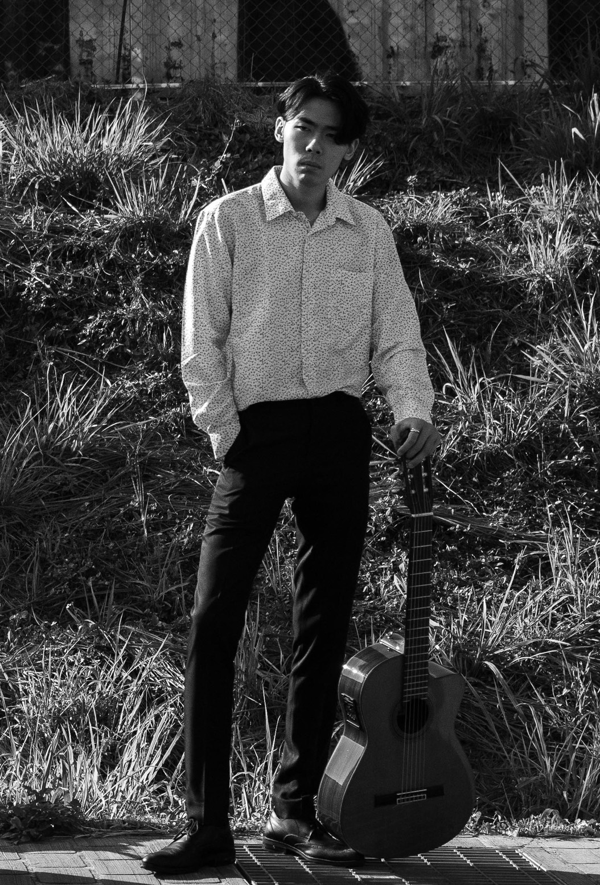
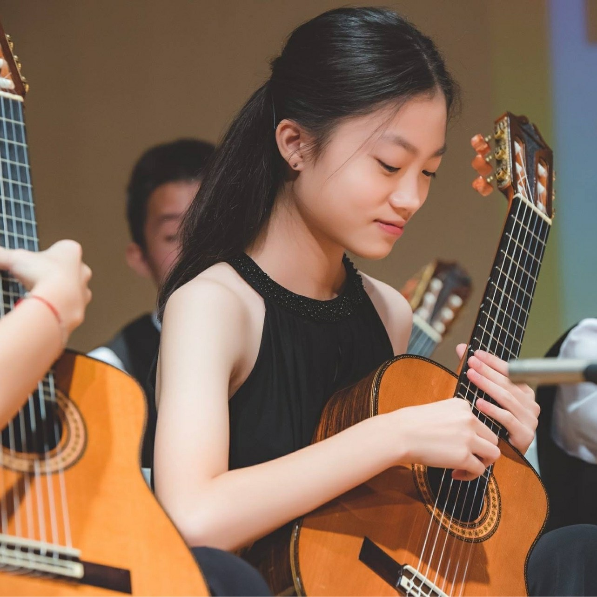
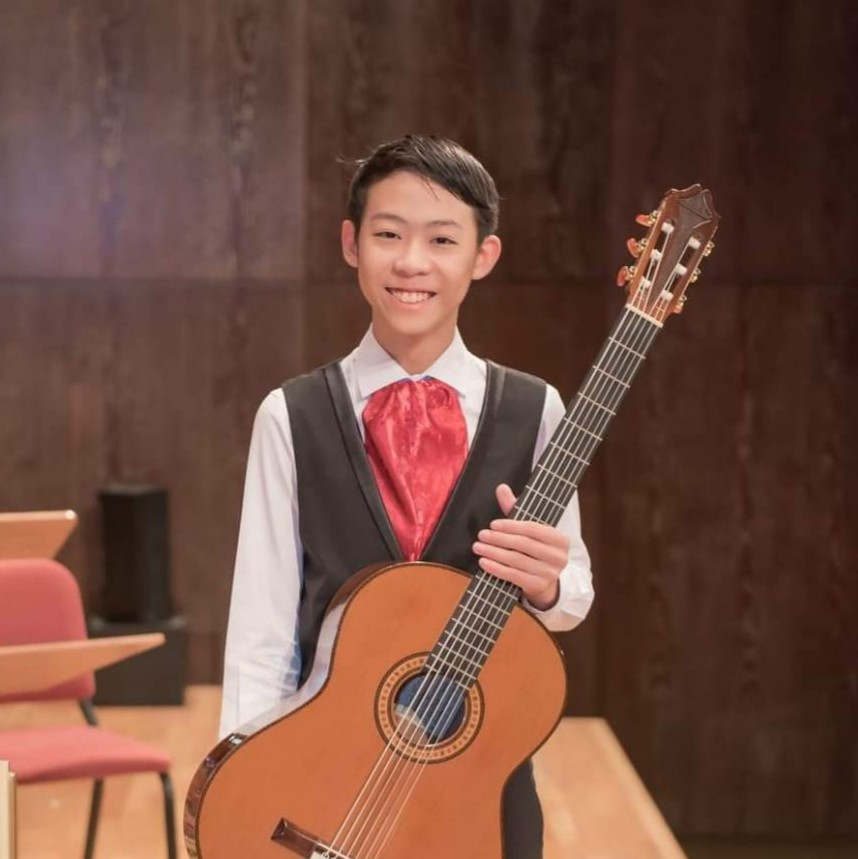
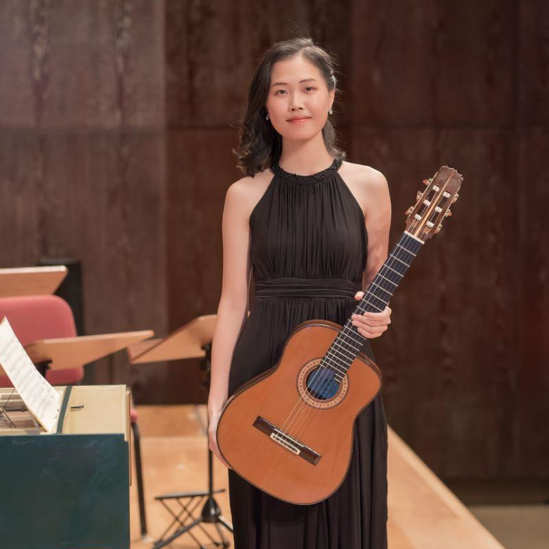

## 賴玠嘉 - *Soprano Guitar / Alto Guitar 2*

現就讀台中市新民高級中學，從幼稚園中班開始學習古典吉他，啟蒙老師為楊琬雯老師和趙柏群老師，現師事鄭雅安老師。2010年開始參加台灣吉他大賽，之後一直到高中二年級間，曾獲2017年馬來西亞泰雷嘉國際吉他大賽重奏公開組第一名，2018年台灣吉他大賽重奏組第一名，獨奏組第二名。從米可創立第一年就一路跟著米可參加各種演出和比賽，也多次獲得台灣吉他大賽重奏及合奏組第一名。

## 吳博申 - *Prime Guitar 1 / Bass Guitar*

現就讀台南應用科技大學音樂系，從國小四年級開始學習古典吉他，學了半年後良心發現突然開竅，也對古典吉他產生了極大的興趣，決定日後朝古典吉他的方向發展。啟蒙老師為趙伯豪老師，現師事趙柏群老師、楊昱泓老師、蘇孟風老師。曾獲2017年台灣吉他大賽國小高年級組第二名、2018年亞洲國際吉他交響樂大賽重奏公開組第二名及合奏公開組第一名。

## 翁子茵 - *Prime Guitar 2 / Prime Guitar / Guitarron*

現就讀於台中逢甲大學外國語文學系，國小四年級開始學習古典吉他，小五參加米可的日本遊學營，發現對古典吉他有很大的興趣，便決定朝古典吉他的方向發展。啟蒙老師為蕭豐御老師，目前主修老師為鄭雅安老師。曾獲2017年泰雷嘉國際吉他大賽重奏公開組第一名、2019年台灣吉他大賽獨奏高中組第二名。

## 孟奕明 - *Cembalo Guitar / Bass Guitar / Guitarron*

國小五年級開始學習古典吉他，六年級時進入米可吉他學習，國一參加教室的日本遊學營後決定往職業發展，高二時開始擔任助教輔佐老師教學，2018年擔任指揮帶領米可吉他合奏團參加亞洲吉他交響樂大賽，榮獲第三名。2016年開始隨樂團陸續受邀至新加坡、馬來西亞、廣州及波蘭演出，也從2017年開始連續拿下三屆台灣吉他大賽重奏組冠軍以及2019亞洲國際吉他交響樂大賽重奏組冠軍。現於米可吉他室內樂團擔任團長一職。

## 陸美心 - *Bass Guitar / Alto Guitar 2 / Prime Guitar*

現就讀台中市新民高級中學音樂班，國小五年級開始學習古典吉他，2018年加入室內樂團，深受啟發，決定朝音樂發展。啟蒙老師為陳鏗仰老師，目前主修老師為鄭雅安老師。曾獲2019年台灣吉他大賽獨奏國中組第三名、2019年台灣吉他大賽重奏公開組第二名。

## 蔡長廷 - *Guitarron*

現就讀台中市新民高級中學音樂班，10歲時開始學習古典吉他，啟蒙老師為趙伯豪老師，現師事鄭雅安老師。2017年與米可吉他室內樂團一同在馬來西亞泰雷嘉音樂節表演，感受到了舞台的魅力，因而產生極大的興趣，決定朝音樂發展。曾獲2018年亞洲國際吉他交響樂大賽重奏組第二名及合奏公開組第一名、2019年台灣吉他大賽重奏組第二名以及2020年日本吉他藝術節獨奏比賽金賞。

## 林紘妙 - *Alto Guitar 1*

西元2000年生於台中市，現就讀國立臺灣藝術大學音樂系，主修古典吉他，師事趙柏群、鄭雅安、張志宇老師。

十二歲習琴，十三歲起加入米可吉他合奏團並多次登台演出，2018年隨樂團於國家歌劇院及國家音樂廳演出。

2017年獲得台灣吉他大賽高中組第二名，2017、2019年獲得重奏組第一名，2014、2015、2017、2019年皆獲得合奏公開組第一名。